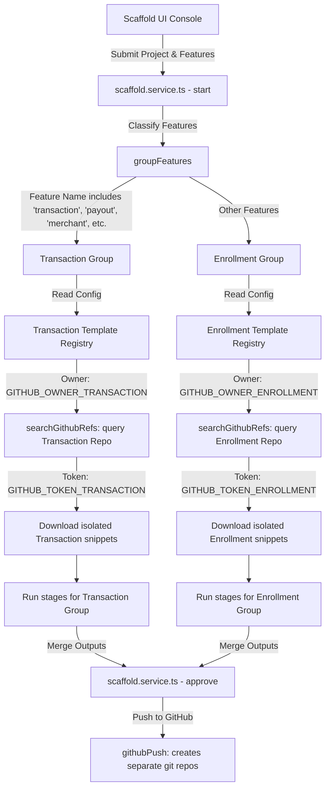

# Transaction Flow Integration & Architecture Document

This document outlines the architecture, data flows, shared files, and integration strategy for the isolated **Transaction Template Flow** within the B2B Scaffolder Service.

---

## 1. Generated Output Files: What, Why, and Filenames

During a scaffolding execution, the generator outputs a fully functional project codebase to a new GitHub repository. The following files are generated:

| Filename | Purpose (What) | Rationale (Why) |
| :--- | :--- | :--- |
| **`db/schema.sql`** | PostgreSQL DDL commands (`CREATE TABLE`, `ALTER TABLE`, indexes, constraints). | Creates the relational database structure required to support all defined features and models. |
| **`docs/architecture.md`** | Mermaid diagrams outlining High-Level System Architecture, Sequence Flow, and Data Flow. | Visualizes interactions between modules, third-party gateways, API endpoints, and database stores. |
| **`docs/api.md`** | Pure OpenAPI 3.0.0 (or 3.1.0) specification in YAML format. | Acts as the contract and single source of truth for routers, requests, queries, headers, and responses. |
| **`docs/README.md`** | Comprehensive project overview, environment setup, and runtime execution instructions. | Onboards developers and operators to deploy the scaffolded repository locally or in staging. |
| **`src/<module>/controllers/<name>.controller.ts`** | NestJS Controllers decorated with HTTP routing endpoints (`@Get`, `@Post`, `@Body`, etc.). | Defines the API routing layer that accepts HTTP calls and handles input validations. |
| **`src/<module>/services/<name>.service.ts`** | NestJS service classes housing business logic, database queries, and third-party API integration code. | Decouples business rules and repository commands from the HTTP controller routing layer. |
| **`src/<module>/dtos/<name>.dto.ts`** | TypeScript Data Transfer Objects decorated with validations (`@IsString`, `@IsUUID`, etc.). | Enforces strict compile-time types and runtime checks on incoming request Payloads. |
| **`src/<module>/entities/<name>.model.ts`** | Sequelize-TypeScript Active Record models mapping columns to DB columns. | Provides Object-Relational Mapping (ORM) to query database records dynamically without writing raw SQL. |
| **`src/<module>/<name>.module.ts`** | NestJS Module file importing required models and registering controllers and services. | Bootstraps dependency injection for the feature-specific NestJS application context. |
| **`src/app.module.ts`** | The root NestJS module registering Sequelize and config modules. | Ties all sub-modules together into a single NestJS execution bundle. |

---

## 2. Scaffold Service Files Modified

To support isolation of the transaction template flow, the following core pipeline files were updated:

1. **[scaffold.service.ts](file:///d:/mimojo-b2b-scaffold/mimojo-b2b-scaffold-service-main/src/scaffold/scaffold.service.ts)**
   - Added `groupFeatures()` to dynamically classify input features.
   - Refactored `runStage` and `runStageInner` to process templates sequentially per group.
   - Configured timing metrics recording on `stage_timings`.
2. **[searchGithubRefs.ts](file:///d:/mimojo-b2b-scaffold/mimojo-b2b-scaffold-service-main/src/nodes/searchGithubRefs.ts)**
   - Removed global shared-refs merging.
   - Configured group-level reference queries from isolated repositories using their respective access tokens.
3. **Pipeline Stages ([extractFunctions.ts](file:///d:/mimojo-b2b-scaffold/mimojo-b2b-scaffold-service-main/src/nodes/extractFunctions.ts), [generateArchitecture.ts](file:///d:/mimojo-b2b-scaffold/mimojo-b2b-scaffold-service-main/src/nodes/generateArchitecture.ts), [generateDocs.ts](file:///d:/mimojo-b2b-scaffold/mimojo-b2b-scaffold-service-main/src/nodes/generateDocs.ts), [generateDbSchema.ts](file:///d:/mimojo-b2b-scaffold/mimojo-b2b-scaffold-service-main/src/nodes/generateDbSchema.ts), [generateCodePlan.ts](file:///d:/mimojo-b2b-scaffold/mimojo-b2b-scaffold-service-main/src/nodes/generateCodePlan.ts), [generateModuleCode.ts](file:///d:/mimojo-b2b-scaffold/mimojo-b2b-scaffold-service-main/src/nodes/generateModuleCode.ts), [validate.ts](file:///d:/mimojo-b2b-scaffold/mimojo-b2b-scaffold-service-main/src/nodes/validate.ts), [fix.ts](file:///d:/mimojo-b2b-scaffold/mimojo-b2b-scaffold-service-main/src/nodes/fix.ts), [github.ts](file:///d:/mimojo-b2b-scaffold/mimojo-b2b-scaffold-service-main/src/nodes/github.ts))**
   - Refactored to loop through individual template groups and store outputs directly under `group.output`.
4. **[scaffold-templates.config.ts](file:///d:/mimojo-b2b-scaffold/mimojo-b2b-scaffold-service-main/src/config/scaffold-templates.config.ts)**
   - Set registry objects dynamically resolving repository paths utilizing organization environment variables.
5. **[index.html](file:///d:/mimojo-b2b-scaffold/mimojo-b2b-scaffold-service-main/public/index.html)**
   - Upgraded UI forms, headers, and tabs to split inputs and render generated code dynamically (e.g., `Both`, `Enrollment`, or `Transaction` output views).
6. **[state.ts](file:///d:/mimojo-b2b-scaffold/mimojo-b2b-scaffold-service-main/src/state.ts)**
   - Added `TemplateGroupState` types to structure pipeline state cleanly.

---

## 3. How the Transaction Flow Attaches to Existing Code

The following architecture diagram represents the dynamic branching of feature flows:



### Flow Routing Rules
Features are dynamically categorized on project kickoff:
- If a feature name contains `transaction`, `payout`, `merchant`, `outlet`, or `payday`, it is mapped to the `transaction` template group.
- Otherwise, it defaults to the `enrollment` template group.
- Each group compiles its own isolated list of references, directory layouts, and controllers. When pushing to GitHub, they deploy to distinct destination repositories:
  - `{projectName}-enrollment`
  - `{projectName}-transaction`

---

## 4. Shared Files & Modules

Both flows share infrastructure configurations and helper frameworks within the pipeline:
1. **[llm.ts](file:///d:/mimojo-b2b-scaffold/mimojo-b2b-scaffold-service-main/src/llm.ts)**: Configures the GPT model configurations (`gpt41` and `o4`) used for all prompts.
2. **[state.ts](file:///d:/mimojo-b2b-scaffold/mimojo-b2b-scaffold-service-main/src/state.ts)**: Houses the central data schema representing both inputs, stages, and outputs.
3. **[scaffold.controller.ts](file:///d:/mimojo-b2b-scaffold/mimojo-b2b-scaffold-service-main/src/scaffold/scaffold.controller.ts)**: Serves the HTTP API routes (`/start`, `/approve`, `/restart`, `/get`) for the pipeline runner.
4. **[index.html](file:///d:/mimojo-b2b-scaffold/mimojo-b2b-scaffold-service-main/public/index.html)**: Provides the single-page application UI dashboard that coordinates form submission and displays final DDLs, models, and YAML documentation.

---

## 5. How to Implement a New Template / Feature

If a new template group (e.g., `reporting` or `audit`) is required, follow these steps:

1. **Add to `.env`**:
   Define organization variables and tokens in your `.env` file:
   ```env
   GITHUB_OWNER_REPORTING=your-org
   GITHUB_TOKEN_REPORTING=ghp_yourToken
   ```
2. **Extend `state.ts` Types**:
   Update `TemplateGroupState` id type to allow the new ID:
   ```typescript
   export interface TemplateGroupState {
     id: 'enrollment' | 'transaction' | 'reporting';
     ...
   }
   ```
3. **Add to scaffold-templates.config.ts**:
   Define repository URL, default branch, and file mapping templates:
   ```typescript
   reporting: {
     repoUrl: `https://github.com/${process.env.GITHUB_OWNER_REPORTING || 'default-org'}/mimojo-reporting-template-service`,
     branch: 'main',
     templates: {
       shared: ['src/common/dtos/base-response.dto.ts'],
       api: ['src/reporting/controllers/report.controller.ts'],
       file: ['src/reporting/controllers/batch-report.controller.ts']
     }
   }
   ```
4. **Update Feature Grouping in scaffold.service.ts**:
   Modify `groupFeatures()` to detect reporting features and route them accordingly:
   ```typescript
   if (nameLower.includes('report') || nameLower.includes('audit')) {
     reportingFeatures.push(f);
   }
   ```
5. **Update UI index.html**:
   Include the new block in UI variables (`TEMPLATE_ORDER`, `TEMPLATE_LABELS`, `TEMPLATE_COLORS`):
   ```javascript
   const TEMPLATE_ORDER = ['enrollment', 'transaction', 'reporting'];
   const TEMPLATE_LABELS = { enrollment: 'Enrollment', transaction: 'Transaction', reporting: 'Reporting' };
   ```
